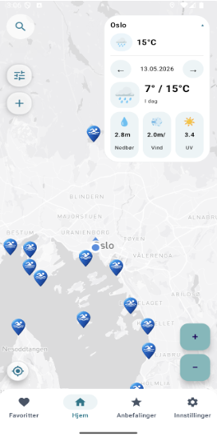
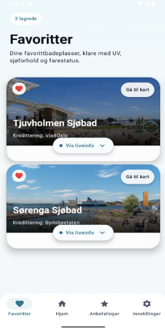

# Splaesh 💧

A mobile app for finding swimming spots and checking local weather conditions.  
Developed as a group project during the 2nd year of our Bachelor's degree in Computer Science at UiO.

---

## About

Splaesh lets users discover designated swimming locations and view real-time weather information for each spot, helping you plan your visit before heading out.

---

## Screenshots

  
  
  
  

---

## Features

- Browse and find designated swimming spots near you
- View weather conditions for each location
- Clean and intuitive user interface

---

## Built with

- Kotlin (Android)

---

## Team and my contributions

The app was developed in a group as part of a 2nd year project at the University of Oslo.

My contributions to the project were:

- Researched and selected the map SDK used as the foundation for the map view
- Implemented weather map layers, allowing users to visualize weather data directly on the map
- Built the time scroller component, enabling users to browse weather conditions at specific times

---

## Status

Completed academic project (May 2026)026)
